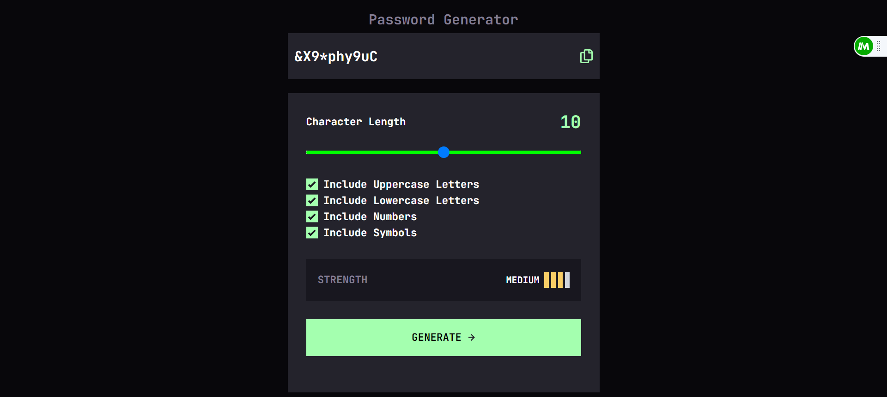

# Frontend Mentor - Password generator app solution

This is a solution to the [Password generator app challenge on Frontend Mentor](https://www.frontendmentor.io/challenges/password-generator-app-Mr8CLycqjh). Frontend Mentor challenges help you improve your coding skills by building realistic projects.

## Overview

### The challenge

Users should be able to:

- Generate a password based on the selected inclusion options
- Copy the generated password to the computer's clipboard
- See a strength rating for their generated password
- View the optimal layout for the interface depending on their device's screen size
- See hover and focus states for all interactive elements on the page

### Screenshot

- Live Site URL: [Click here](https://password-generator-513rg01lq-azammustafa66.vercel.app/)

### Built with

- Semantic HTML5 markup
- Flexbox
- Mobile-first workflow
- [Vite](https://vitejs.dev/) - For dev server and build
- [React](https://reactjs.org/) - JS library
- [Tailwind](https://tailwindcss.com/) - For styles
- [Redux](https://redux.js.org/) - For state management

## Author

- Twitter - [@MustufaAzam](https://twitter.com/MustufaAzam)
- LinkedIn - [Azam Mustufa](https://www.linkedin.com/in/azam-mustufa-didagur-304874245/)
